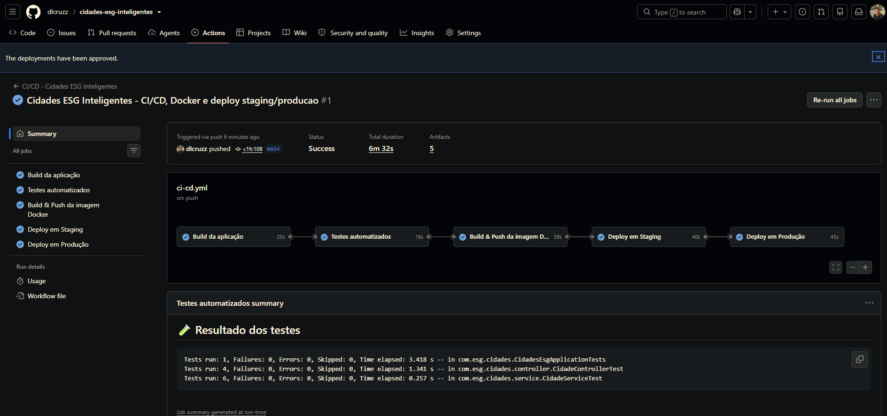
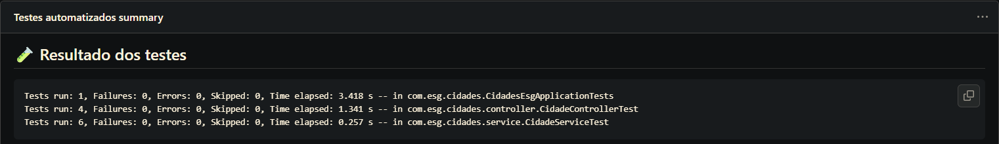
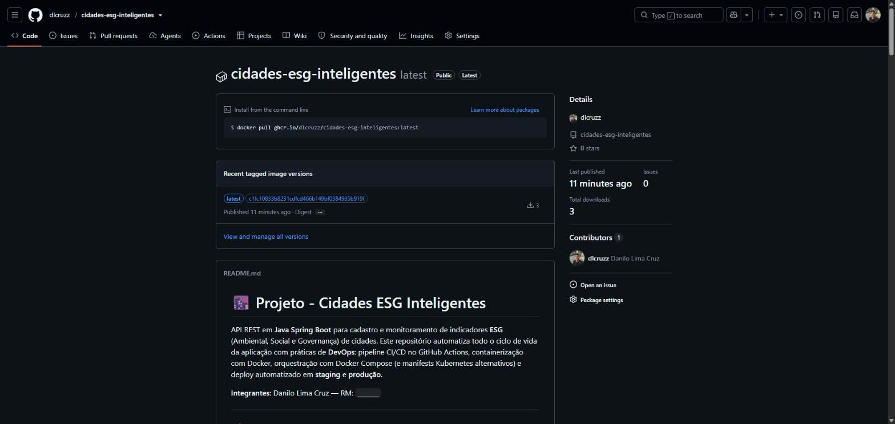
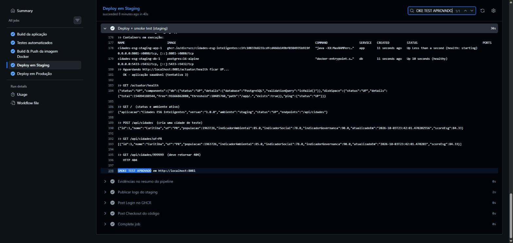
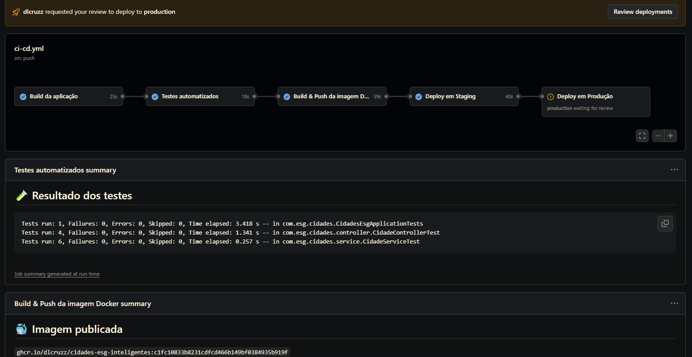
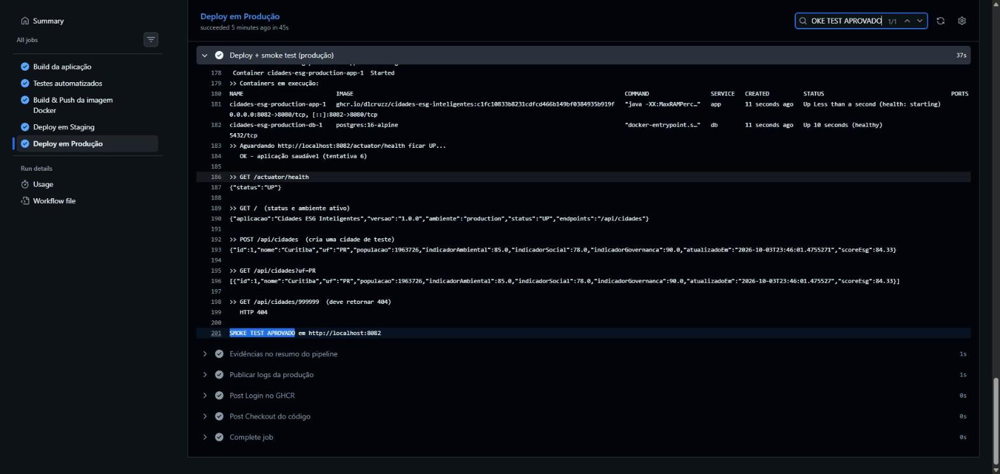

# 🌆 Projeto - Cidades ESG Inteligentes

API REST em **Java Spring Boot** para cadastro e monitoramento de indicadores **ESG** (Ambiental, Social e Governança) de cidades. Este repositório automatiza todo o ciclo de vida da aplicação com práticas de **DevOps**: pipeline CI/CD no GitHub Actions, containerização com Docker, orquestração com Docker Compose (e manifests Kubernetes alternativos) e deploy automatizado em **staging** e **produção**.

**Integrantes:** Danilo Lima Cruz — RM: `______`

---

## 📌 Sobre a aplicação

- CRUD de cidades com indicadores ambiental, social e de governança (0–100).
- Cálculo automático do **score ESG** (média dos três pilares).
- Busca por UF e por nome.
- `GET /` mostra qual ambiente está ativo (`staging` ou `production`).
- Health check em `/actuator/health`, usado pelo Docker, pelo Kubernetes e pelo pipeline.

| Método | Rota | Descrição |
|--------|------|-----------|
| GET | `/` | Status da aplicação e ambiente ativo |
| GET | `/api/cidades` | Lista todas as cidades |
| GET | `/api/cidades?uf=PR` | Filtra por UF |
| GET | `/api/cidades?nome=curi` | Filtra por nome (parcial) |
| GET | `/api/cidades/{id}` | Busca por id |
| POST | `/api/cidades` | Cria uma cidade |
| PUT | `/api/cidades/{id}` | Atualiza uma cidade |
| DELETE | `/api/cidades/{id}` | Remove uma cidade |
| GET | `/actuator/health` | Health check |

---

## 🐳 Como executar localmente com Docker

**Pré-requisitos:** Docker Desktop (com Docker Compose v2) e Git. No Windows, rode os scripts `.sh` pelo **Git Bash**.

1. Clone o repositório e entre na pasta:
   ```bash
   git clone https://github.com/dlcruzz/cidades-esg-inteligentes.git
   cd cidades-esg-inteligentes
   ```
2. Crie o arquivo de variáveis de ambiente:
   ```bash
   cp .env.example .env      # ajuste a senha do banco se quiser
   ```
3. Suba aplicação + banco:
   ```bash
   docker compose --env-file .env up -d --build
   ```
4. Teste no navegador ou com curl:
   ```
   http://localhost:8080/
   http://localhost:8080/api/cidades
   http://localhost:8080/actuator/health
   ```
5. Para derrubar:
   ```bash
   docker compose down        # mantém os dados (volume)
   docker compose down -v     # apaga também o volume do banco
   ```

### Simulando staging e produção na sua máquina

Os mesmos scripts usados pelo pipeline funcionam localmente. Cada ambiente roda isolado (rede, volume e porta próprios):

```bash
bash scripts/deploy.sh staging       # http://localhost:8081  (profile staging)
bash scripts/deploy.sh production    # http://localhost:8082  (profile production, banco sem porta exposta)

bash scripts/destroy.sh staging      # derruba (adicione --volumes para apagar os dados)
bash scripts/destroy.sh production
```

`scripts/deploy.sh` sobe o ambiente e chama `scripts/smoke-test.sh`, que espera o health check ficar `UP`, confere o ambiente ativo, cria uma cidade, consulta a lista e valida o 404.

### Alternativa: Kubernetes

Manifests na pasta `k8s/` (Deployment + Service da API com probes, StatefulSet + Service do Postgres com PVC, ConfigMap/Secret de exemplo):

```bash
kubectl apply -f k8s/configmap-secret.example.yaml   # copie e ajuste as senhas antes
kubectl apply -f k8s/db-statefulset.yaml
kubectl apply -f k8s/app-deployment.yaml
```

---

## ⚙️ Pipeline CI/CD

**Ferramenta:** GitHub Actions — arquivo [`.github/workflows/ci-cd.yml`](.github/workflows/ci-cd.yml).

### Gatilhos
- `push` na `main` → pipeline completo.
- `pull_request` para `main` → só build + testes (gate de qualidade antes do merge).
- `workflow_dispatch` → execução manual pela aba **Actions**.

### Etapas

```
build ──► test ──► docker-build-push ──► deploy-staging ──► deploy-production
```

| Job | O que faz |
|-----|-----------|
| **build** | JDK 17 + `mvn clean package -DskipTests`; publica o `.jar` como artefato. |
| **test** | `mvn test` com profile `test` (H2 em memória, sem depender de banco externo). 11 testes: JUnit 5, Mockito e MockMvc. Publica o relatório Surefire e um resumo na página da execução. |
| **docker-build-push** | Build da imagem pelo `Dockerfile` e push no **GitHub Container Registry** com duas tags: SHA do commit e `latest`. |
| **deploy-staging** | Usa o GitHub Environment `staging`. Baixa a imagem do GHCR e executa `scripts/deploy.sh staging`: sobe API + PostgreSQL com Docker Compose (profile `staging`) e roda o smoke test. Logs viram artefato e aparecem no resumo. |
| **deploy-production** | Só roda se staging passou (`needs`). Usa o Environment `production` (pode exigir **aprovação manual**). Executa `scripts/deploy.sh production`: Compose com o override de produção (profile `production`, limites de CPU/memória, `restart: always`, banco sem porta exposta) + smoke test. |

### Onde o deploy acontece
Os dois ambientes são criados de verdade a cada execução: os containers da **mesma imagem** publicada no GHCR sobem no runner do GitHub Actions, cada um com sua rede, volume e configuração, e são validados por requisições HTTP reais. O runner é descartado ao fim do job, então os ambientes são **efêmeros** — a evidência fica no resumo da execução e nos artefatos `logs-staging` e `logs-production`. Para um servidor permanente, basta trocar o passo de deploy por um `ssh servidor "bash scripts/deploy.sh <ambiente> <imagem>"` — o script é o mesmo.

### Configuração única no GitHub
1. Suba o projeto para um repositório e use a branch `main`.
2. **Settings → Actions → General → Workflow permissions**: marque *Read and write permissions* (para publicar a imagem no GHCR).
3. **Settings → Environments**: crie `staging` e `production`. Em `production`, ative *Required reviewers* e coloque seu usuário (aprovação manual antes de produção).
4. (Opcional) Em cada environment, crie o secret `POSTGRES_PASSWORD`.
5. Faça um push na `main` (ou rode manualmente em **Actions → CI/CD → Run workflow**).

---

## 📦 Containerização

### Dockerfile

```dockerfile
# ==========================================================
# Dockerfile - Cidades ESG Inteligentes
# Estratégia: build multi-stage para manter a imagem final
# enxuta (sem Maven/JDK completo) e mais segura (usuário
# não-root, apenas JRE em runtime).
# ==========================================================

# ---------- STAGE 1: build ----------
FROM maven:3.9-eclipse-temurin-17 AS build

WORKDIR /app

# Copia apenas o pom.xml primeiro para aproveitar o cache de camadas
# do Docker: dependências só são baixadas de novo se o pom mudar.
COPY pom.xml .
RUN mvn -B dependency:go-offline

# Copia o restante do código-fonte e gera o artefato .jar
COPY src ./src
RUN mvn -B clean package -DskipTests

# ---------- STAGE 2: runtime ----------
FROM eclipse-temurin:17-jre-jammy AS runtime

# wget é usado apenas pelo HEALTHCHECK abaixo
RUN apt-get update && apt-get install -y --no-install-recommends wget \
    && rm -rf /var/lib/apt/lists/*

# Usuário não-root por segurança
RUN groupadd -r esg && useradd -r -g esg esgapp

WORKDIR /app

# Copia apenas o .jar gerado no estágio de build (imagem final não tem Maven/JDK)
COPY --from=build /app/target/cidades-esg-inteligentes.jar app.jar

RUN chown -R esgapp:esg /app
USER esgapp

EXPOSE 8080

# Healthcheck usado pelo docker-compose / orquestrador
HEALTHCHECK --interval=30s --timeout=5s --start-period=40s --retries=3 \
  CMD wget --no-verbose --tries=1 --spider http://localhost:8080/actuator/health || exit 1

# MaxRAMPercentage: a JVM respeita o limite de memória do container
ENTRYPOINT ["java", "-XX:MaxRAMPercentage=75.0", "-jar", "app.jar"]
```

### Estratégias adotadas
- **Multi-stage build:** Maven + JDK só no estágio de build; a imagem final tem apenas JRE + `.jar` (menor e com menos superfície de ataque).
- **Cache de dependências:** o `pom.xml` é copiado e as dependências baixadas antes do código, então mudar só o código não baixa tudo de novo.
- **Usuário não-root** (`esgapp`) executando a aplicação.
- **HEALTHCHECK** consultando `/actuator/health`.
- **`-XX:MaxRAMPercentage=75`** para a JVM respeitar o limite de memória do container.
- **`.dockerignore`** evita mandar `target/`, `.git/`, `docs/` e `.env` para o contexto de build.

### Orquestração (`docker-compose.yml`)
- Serviços `app` (Spring Boot) e `db` (PostgreSQL 16), com `depends_on: condition: service_healthy` — a API só sobe quando o banco está pronto.
- **Rede** dedicada `esg-network` (bridge).
- **Volume nomeado** `esg-db-data` para persistir os dados do banco.
- **Variáveis de ambiente** via `.env` (modelo em `.env.example`): credenciais, porta, profile Spring e imagem.
- **`docker-compose.production.yml`** como override de produção: profile `production`, limites de recursos, `restart: always` e banco sem porta publicada.
- Sem `container_name` fixo: staging e produção coexistem no mesmo host com nomes de projeto diferentes.

### Profiles Spring
| Profile | Uso | Diferenças |
|---------|-----|------------|
| `test` | Pipeline (testes) | H2 em memória, `create-drop` |
| `staging` | Homologação | SQL no log, logs em DEBUG, health detalhado |
| `production` | Produção | Sem SQL no log, logs enxutos, sem stacktrace/mensagem nos erros, health sem detalhes |

---

## 🖼️ Prints do funcionamento

> Prints salvos em `docs/prints/`. Execução do pipeline: aba **Actions** do repositório.

| Evidência | Print |
|-----------|-------|
| Pipeline completo (todos os jobs verdes) |  |
| Testes automatizados passando |  |
| Imagem publicada no GHCR |  |
| Deploy em **staging** + smoke test |  |
| Aprovação manual de produção |  |
| Deploy em **produção** + smoke test |  |
| `docker compose up` local (app + db) |  |
| API respondendo (`/` e `/api/cidades`) |  |

---

## 🛠️ Tecnologias utilizadas

- **Linguagem/Framework:** Java 17, Spring Boot 3.3 (Web, Data JPA, Validation, Actuator)
- **Banco de dados:** PostgreSQL 16 (staging/produção) e H2 (testes)
- **Build:** Maven
- **Testes:** JUnit 5, Mockito, Spring Boot Test (MockMvc)
- **Containerização:** Docker (multi-stage)
- **Orquestração:** Docker Compose; manifests Kubernetes alternativos
- **CI/CD:** GitHub Actions + GitHub Environments
- **Registro de imagens:** GitHub Container Registry (GHCR)
- **Scripts:** Bash (`deploy.sh`, `smoke-test.sh`, `destroy.sh`)

---

## 📁 Estrutura

```
cidades-esg-inteligentes/
├── .github/workflows/ci-cd.yml      # pipeline CI/CD
├── docs/                            # documentação PDF + prints
├── k8s/                             # alternativa Kubernetes
├── scripts/                         # deploy, smoke test, destroy
├── src/                             # código-fonte e testes
├── Dockerfile
├── docker-compose.yml
├── docker-compose.production.yml
├── .env.example
└── README.md
```

---

## ✅ Checklist de entrega

| Item | OK |
|------|----|
| Projeto compactado em .ZIP com estrutura organizada | ☐ |
| Dockerfile funcional | ☐ |
| docker-compose.yml ou arquivos Kubernetes | ☐ |
| Pipeline com etapas de build, teste e deploy | ☐ |
| README.md com instruções e prints | ☐ |
| Documentação técnica com evidências (PDF ou PPT) | ☐ |
| Deploy realizado nos ambientes staging e produção | ☐ |
